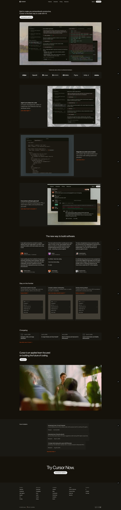

# Cursor Landing Page

A practice project that replicates the [Cursor](https://cursor.com) code editor landing page. Static HTML and CSS, no build step.

### Check out live page https://cursor-landing-clone.vercel.app/

---

## Fonts

- **Primary font:** **CursorGothic**, used for all body text and headings.
- **Defined in:** `styles/root.css` via `@font-face` (Regular, Italic, Bold, Bold Italic).
- **Fallbacks:** `"CursorGothic Fallback", system-ui, Helvetica Neue, Helvetica, Arial, sans-serif`.
- **Source files:** `assets/fonts/*.woff2` (subset WOFF2).

| Style   | File (in `assets/fonts/`)                    | Weight | Style  |
|--------|----------------------------------------------|--------|--------|
| Regular | `CursorGothic_Regular-s.p.a361088d.woff2`   | 400    | normal |
| Italic  | `CursorGothic_Italic-s.p.00bb2606.woff2`    | 400    | italic |
| Bold    | `CursorGothic_Bold-s.p.95169710.woff2`      | 700    | normal |
| Bold Italic | `CursorGothic_BoldItalic-s.p.036859cb.woff2` | 700 | italic |

---

## Colors

Defined in `styles/root.css` as CSS custom properties. Dark theme by default.

| Variable                     | Value / meaning                    | Usage |
|-----------------------------|-------------------------------------|--------|
| `--color-theme-bg`          | `#14120b`                           | Page background |
| `--color-theme-fg`          | `#edecec`                           | Primary text, primary button |
| `--color-theme-fg-02`       | `#d7d6d5`                           | Secondary text, button hover |
| `--color-theme-fg-10`       | `color-mix(… 10% transparent)`      | Low-emphasis overlay |
| `--color-theme-card-hex`    | `#1b1913`                           | Card background |
| `--color-theme-card-01-hex` | `#1d1b15`                           | Card variant |
| `--color-theme-card-02-hex` | `#201e18`                           | Card variant |
| `--color-theme-card-03-hex` | `#26241e`                           | Card variant |
| `--color-theme-card-hover-hex` | `#201e18`                         | Card border, hover |
| `--color-theme-accent`      | `#f54e00`                           | Accent (e.g. links) |
| `--color-theme-accent-hover`| `color-mix(… 75% transparent)`      | Accent hover |
| `--color-theme-text-sec`    | `color-mix(… 60% transparent)`      | Secondary text |
| `--color-theme-border-02-5`  | `color-mix(… 20% transparent)`      | Borders (e.g. secondary button) |

Other layout variables: `--max-width-container: 1300px`, `--site-header-height: 52px`, spacing via `--g` and `--v`.

---

## Sections (from `index.html`)

### Header (`#site-header`)

- Logo (SVG) linking to `#`
- Nav: Features, Enterprise, Pricing, Resources (external cursor.com links)
- Actions: Sign in, Download

### Main

1. **Hero (`#hero-section`)**
   Headline, “Download for macOS” CTA, hero image (`hero-banner.jpg`).

2. **Trusted companies (`#trusted-company`)**
   “Trusted every day by millions…” plus a row of company logos (Stripe, OpenAI, Linear, Datadog, NVIDIA, Figma, Ramp, Adobe).

3. **Featured (`#featured-section`)**
   Three large feature blocks (alternating layout):
   - Agent: “Agent turns ideas into code”
   - Tab: “Magically accurate autocomplete”
   - Ecosystem: “Everywhere software gets built”
   Each has copy, “Learn about…” link, and image.

4. **Testimonials (`#testimonials-section`)**
   “The new way to build software” plus a grid of quote cards (Diana Hu, shadcn, Andrej Karpathy, Patrick Collison, ThePrimeagen, Greg Brockman) with avatars and titles.

5. **Stay on the frontier (`#featured-card-section`)**
   Three cards: “Use the best model for every task”, “Complete codebase understanding”, “Develop enduring software” with “Explore Model” / “Learn more…” / “Explore enterprise” links.

6. **Changelog (`#changelog-section`)**
   “Changelog” heading and list of version/date + title (e.g. 2.4, 2.3, recent dates) linking to cursor.com/changelog, plus “See what’s new in Cursor”.

7. **Team (`#team-section`)**
   “Cursor is an applied team…” copy, “Join us →” CTA, team photo (`cursor-team.jpg`).

8. **Recent highlights (`#hightlights-section`)**
   “Recent highlights” with blog-style items (e.g. Cursor 2.0 and Composer, Tab RL, MXFP8 kernels) and “View More Posts →”.

9. **Final CTA (`#final-cta`)**
   “Try Cursor Now.” and “Download for macOS” button.

### Footer (`#footer`)

- **Nav columns:** Product, Resources, Company, Legal, Connect (links to cursor.com pages).
- **Bottom bar:** “© 2026 Cursor”, “SOC 2 Certified”, theme selector (desktop / sun / moon; moon selected).

---

## Running Locally

Open `index.html` in a browser (e.g. drag into Chrome/Firefox or use a simple static server). No build or install required.

## Screenshot

